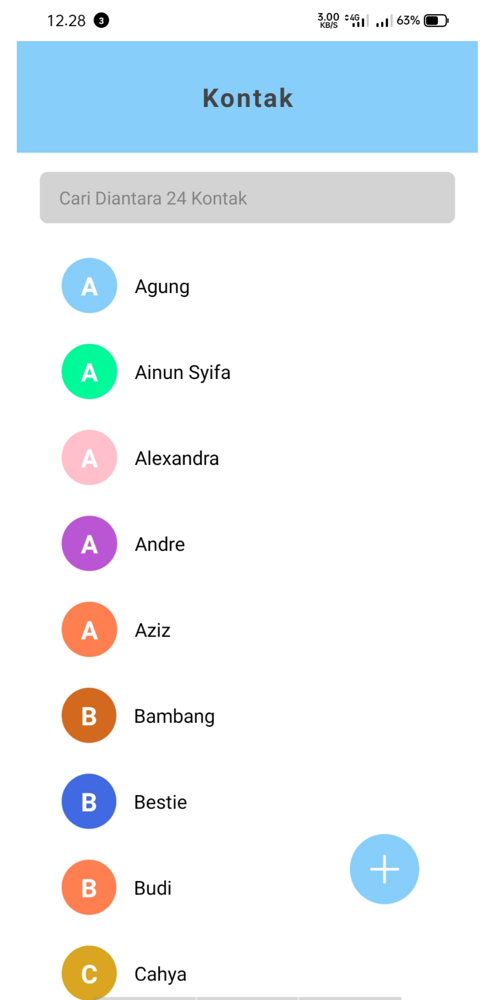
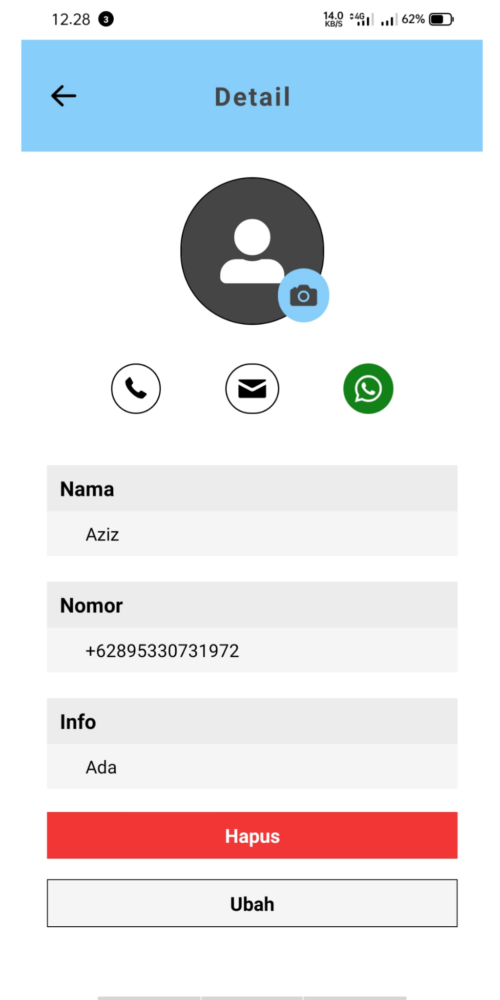
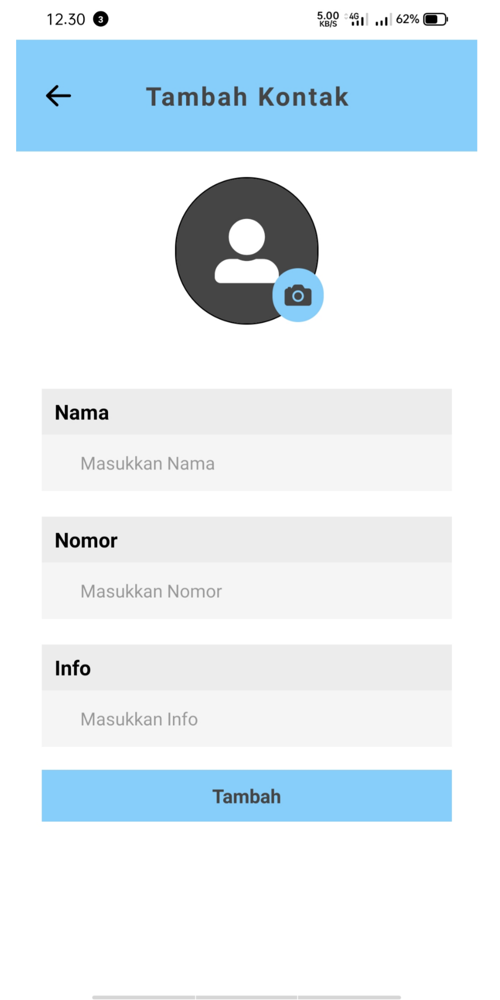

# My Kontak App

Aplikasi Kontak Android Sederhana dengan React Native <br>
Aplikasi Hanya dapat berjalan dengan baik pada perangkat Android (website dan ios tidak) <br>
Nama Aplikasi : My Kontak App <br>
Tanggal Pembuatan : 21 April 2022 <br>

<!-- GIF -->
<div align="center">
  
</div>
<br>
<br>

## Instalasi Aplikasi

### File Drive

Download Aplikasi Pada Link Berikut, Kemudian Instal Pada Android Anda <br>
Link : <a href="https://bit.ly/kontak-react-native">bit.ly/kontak-react-native </a>

### Dengan npm dan git

1. Clone repository ini dengan menjalankan perintah berikut <br>

   ```
   $ git clone https://github.com/mriskiaziz/Aplikasi-Kontak-React-Native.git
   ```

2. Install npm, kemudian jalankan perintah berikut pada cmd <br>
   ```
   $ cd AwesomeProject
   ```
   ```
   $ npm install
   ```
   ```
   $ npm start
   ```

## Halaman Aplikasi

<div align="center">
  
  
  
</div>

## Deskripsi Aplikasi

Aplikasi dibuat menggunakan react native dengan bantuan API contact yang ada di <a href="https://docs.expo.dev/versions/v44.0.0/sdk/contacts/"> expo contact documentation </a>. Aplikasi merupakan bentuk sederhana yang dapat menyimpan nomer telepon pengguna yang ada di ponsel android. <br>
Beberapa fitur aplikasi ini ialah sebagai berikut :

<table>
  <tr>
    <th>Fitur</th>
    <th>Ya</th>
    <th>Tidak</th>
  </tr>
  <tr>
    <td>Menampilkan Kontak</td>
    <td> ✅ </td>
    <td> 🚫 </td>
  </tr>
    <tr>
    <td>Mencari nama pengguna pada Kontak</td>
    <td> ✅ </td>
    <td> 🚫 </td>
  </tr>
    <tr>
    <td>Melihat Informasi Kontak</td>
    <td>✅</td>
    <td> 🚫 </td>
  </tr>
    <tr>
    <td>Menambahkan Kontak</td>
    <td> 🚫 </td>
    <td> ✅ </td>
  </tr>
  <tr>
    <td>Menghapus Kontak</td>
    <td> 🚫 </td>
    <td> ✅ </td>
  </tr>
  <tr>
    <td>Mengubah Kontak</td>
    <td> 🚫 </td>
    <td> ✅ </td>
  </tr>
</table>

## Daftar Package Yang Digunakan

Beberapa package yang digunakan pada aplikasi ini : <br>

1. React navigation : <a href="https://reactnavigation.org/">@react-navigation/native </a> Versi 6.0.10 <br>
2. Stack navigation : <a href="https://reactnavigation.org/docs/hello-react-navigation">@react-navigation/native-stack </a> Versi 6.6.1 <br>
3. Expo : <a href="https://docs.expo.dev/">@expo </a> Versi 44.0.0 <br>
4. React : <a href="https://reactjs.org/">@React </a> Versi 17.0.1 <br>
5. React Native : <a href="https://reactnative.dev/">@react-native </a> Versi 0.64.3 <br>
6. Expo Contact Api : <a href="https://docs.expo.dev/versions/v44.0.0/sdk/contacts/">@expo-contacts </a> Versi 10.1.0 <br>
7. Expo Icon : <a href="https://icons.expo.fyi/"> @expo/vector-icons </a> Versi 13.0.0 <br>
